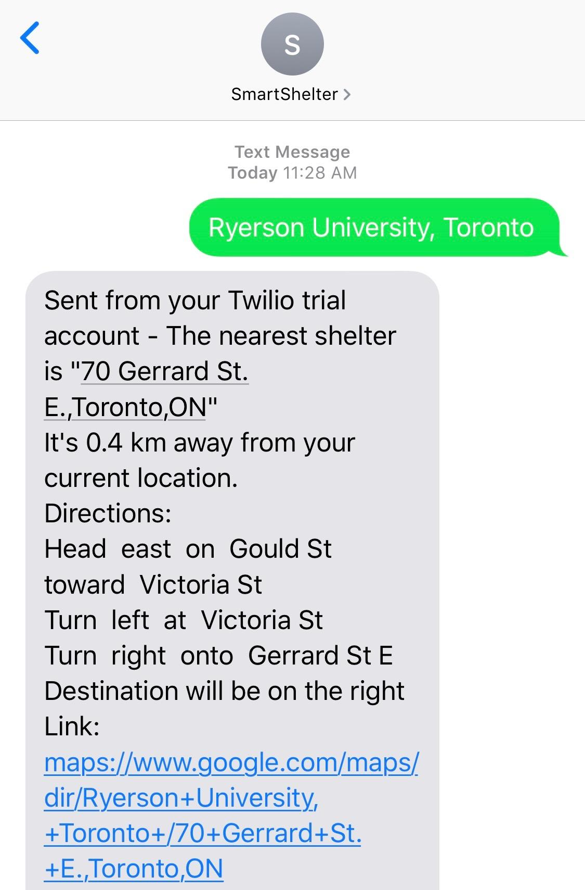

# SmartShelter
SmartShelter is a messaging app meant to help homeless and low-income people find important resources closest to their searched location.
This app can help people who are near homeless, very low-income, even people who have just lost their homes (fire emergency, refugees, etc.)

SmartShelter does not need data or wifi - it can work on Android, iOS, even a prepaid $25 flip phone, toll-free number.

We built the app using Python (Flask), Twilio's APIs, Google Cloud Platform, Mapbox's APIs, OpenWeatherMap, Open-Data (Toronto), and BeautifulSoup (scraping complies with the site's robots.txt).

## How it works
A user sends a message to the number with their location (or whatever location they search) and receives the following information:

	1) Nearest Homeless Shelter + walking directions
	2) Nearest Food Bank + walking directions
	3) Current weather data

Since the whole application was made using API's, it is modular, microservices based, and any new service/API (Hospital, banks, libraries...) can be added or removed with ease, opening up possibilities for future expansion.


## How to install
You need the file `API_KEYS.py` with the corresponding API keys. Also make a Twilio account and a register a phone number for messaging.
- Install dependencies ```pip install -r requirements.txt```
- Move the installed file to homelesshack directory.
- Run by going to homelesshack and running python app.py
- Run the server

## Output

